# My Docs Box

*UNDER CONSTRUCTION*

##  Description

A Books-based docs android app with tags-filter and rich settings including DB backup and restore initiated and updated using Shared preferences.

##  Key highlights

- Bilingual \[en, ar\]
- Dark theme
- Powerful settings

## Written in Java with

- Room
- RxJava
- MVVM
- Glide
- Content Provider
- SharedPreferences
- Data / View Binding
- androidx.ViewModel
    - `LiveData`
    - `MutableLiveData`
- Fragments
    - `BottomSheet`
    - `AlertDialog`
- Views
    - `ConstraintLayout`
    - `RecyclerView`
    - `CardView`
    - `Chip`, `ChipGroup`
    - FAB
- Menus

## Screenshots

    
Splash Screen

    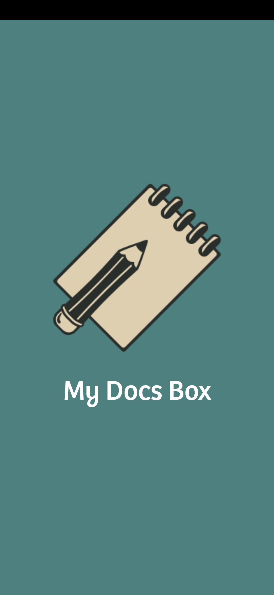
    
Main Screen / list all docs found in a specific book / <b>Compact</b> Mode

    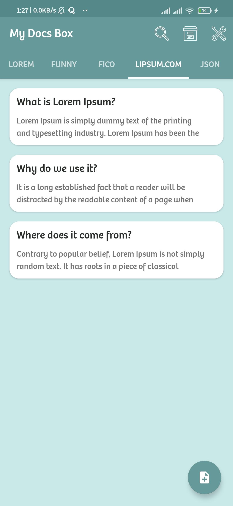
    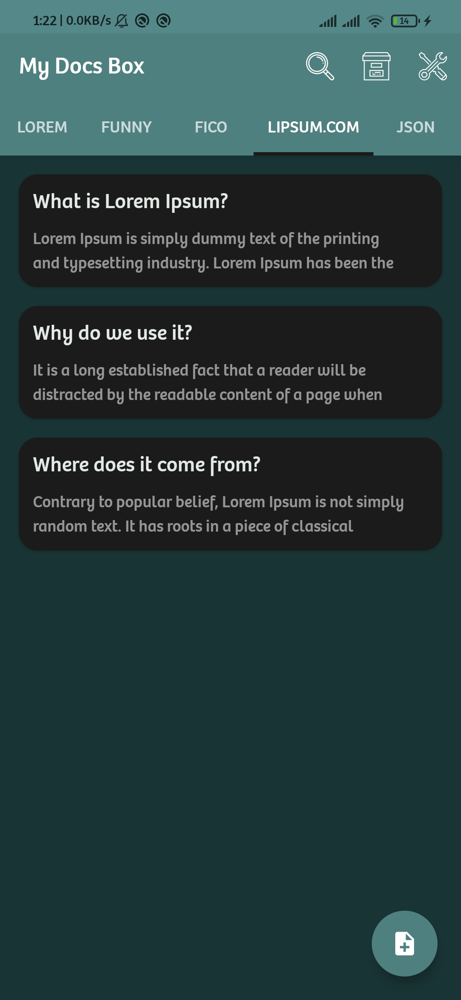
    
Main Screen / list all docs found in a specific book / <b>Informative</b> Mode

    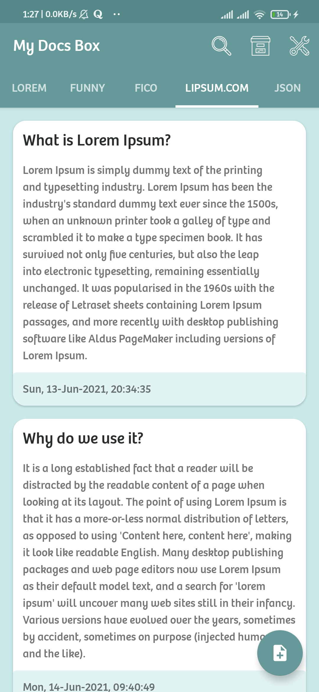
    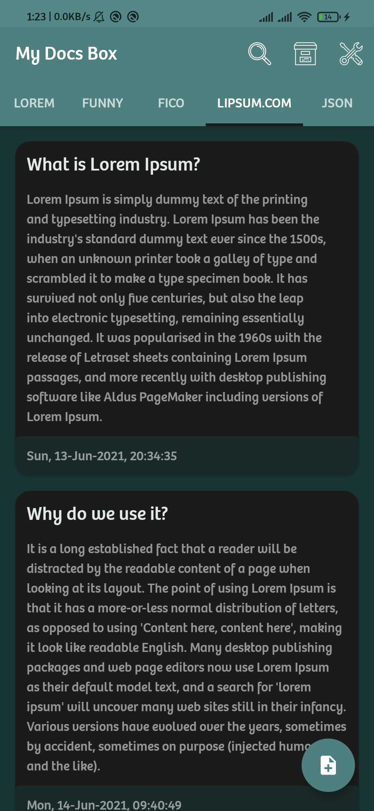
    
Settings grouped into (Manage / General / Appearence / Database / Contact)

    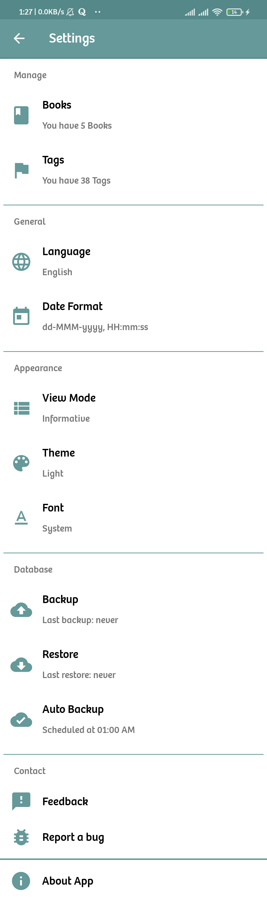
    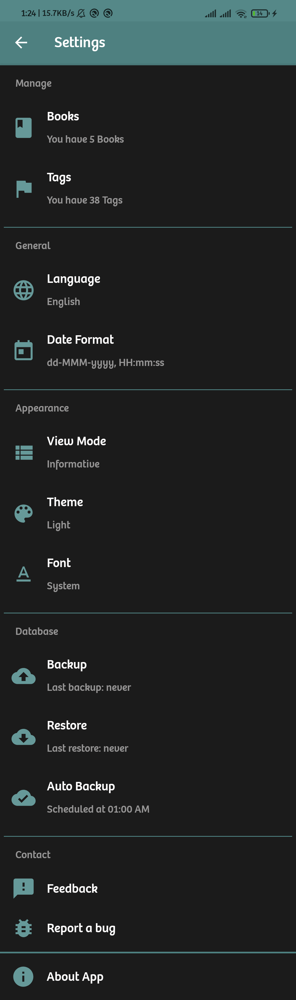
    
List all books / tags with functionality of <b>Edit</b> and <b>Delete</b> each

    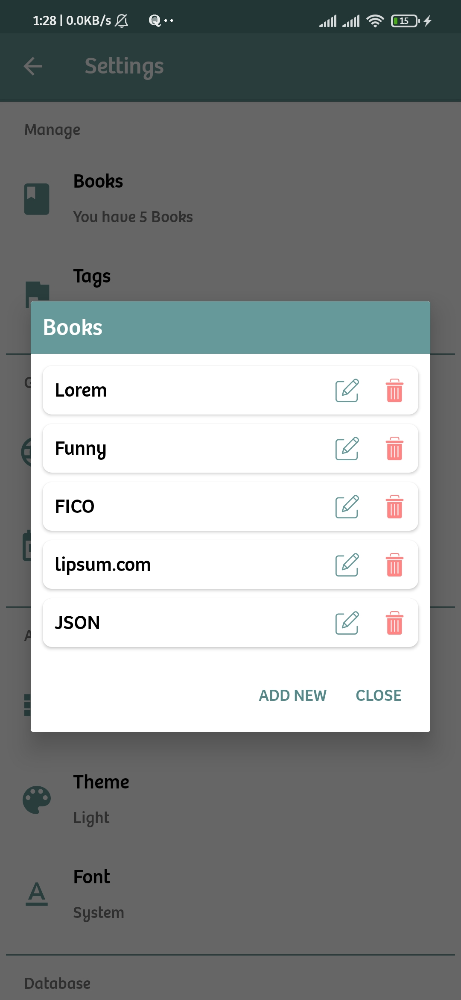
    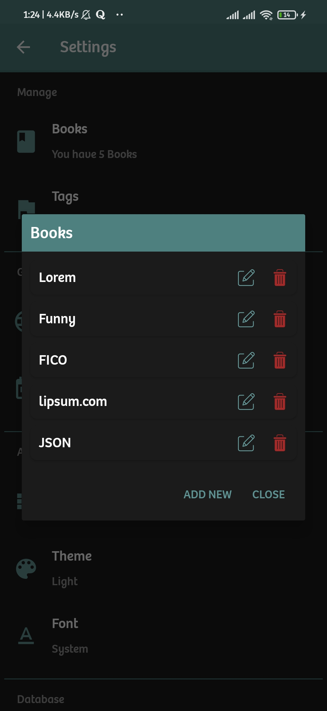
    
Add new book / tag

    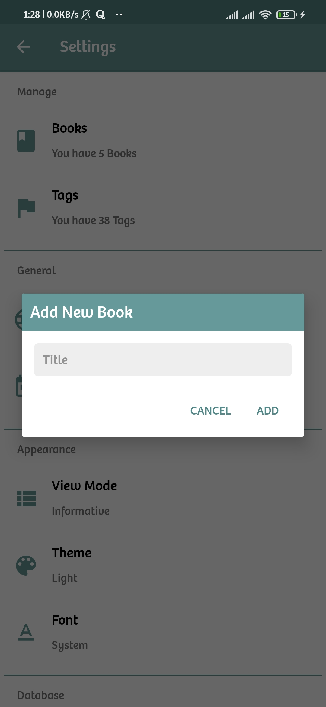
    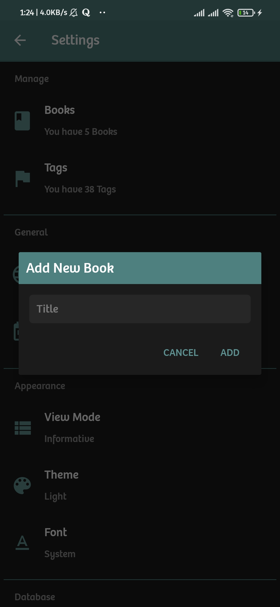
    
About

    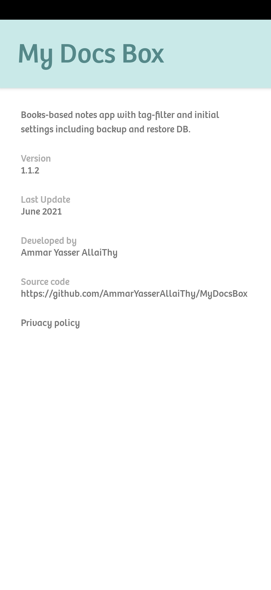
    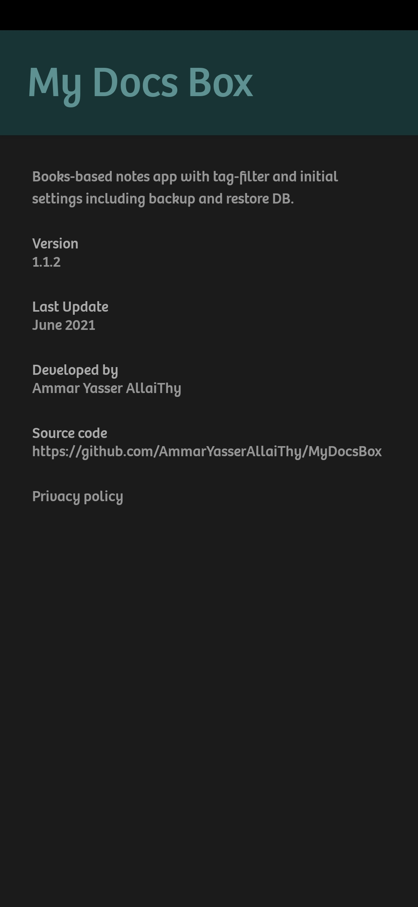

